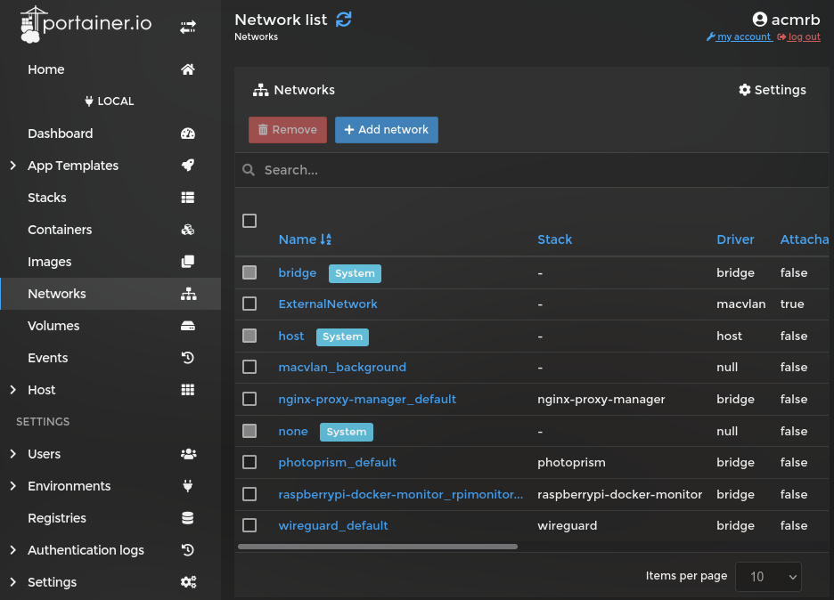
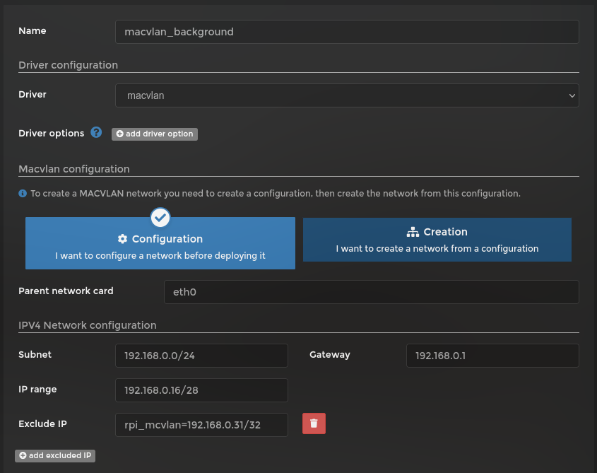
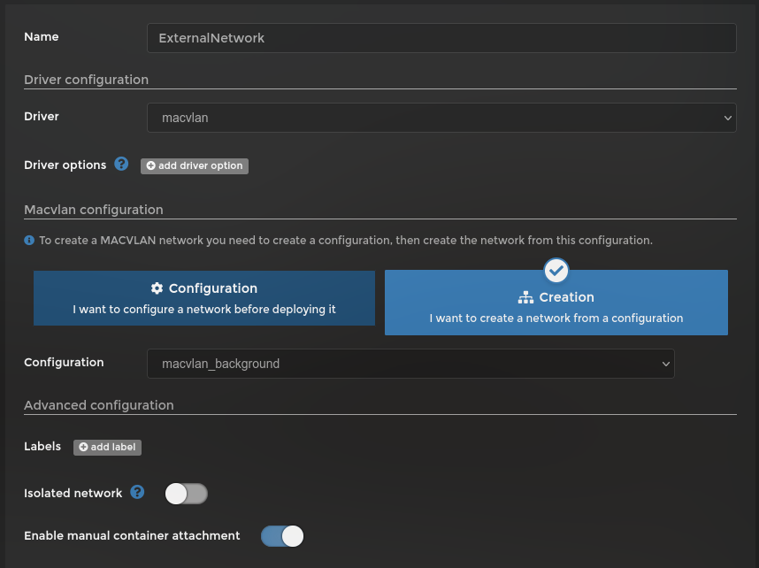
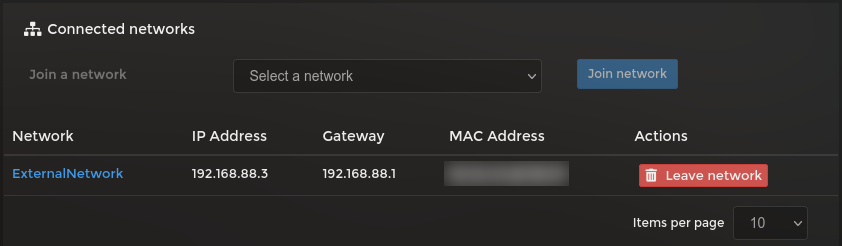

# Attach a container directly to local network

Sometimes it's required, or better, to connect a docker directly to your local network, so it has an IP given by your router (or your [DHCP](https://en.wikipedia.org/wiki/Dynamic_Host_Configuration_Protocol) server).

We can do so setting up a **macvlan** network in Portainer. It will allow a docker on that _lan_ to connect directly to your local network.


## Preparation

### What is required

- Local IP network using [CIDR](https://en.wikipedia.org/wiki/Classless_Inter-Domain_Routing) notation, [see below a simple explanation](#simple-cidr-explanation).
- Your Router IP (or gateway)
- A range of IPs not used by your router DHCP server
- The interface used by the Raspberry Pi for internet
- Modify Raspberry pi `/etc/network/interfaces` to add a custom route


### Simple CIDR explanation

CIDR is a compact representation of an IP address and its associated network mask, that will define the IP range available for a given subnet.

An IPv4 address have a total of **32 bits** that we normally split in **4** groups of **8 bits**. The CIDR notation will define how many bits (from left to right) can't be changed. Let's see an example:

Normally, our router will haven an IP like `192.168.0.1` and a mask of `255.255.255.0`. This means that the last group can have any number from `0` to `255`. As we can see, the last group can be changed within our subnet to any number, but all others has to be kept the same. This means that **3** groups of **8 bits** each have to be fixed, given a total of 24 bits fixed. The CIDR for this network will be `192.168.0.1/24`.

Standard CIDR notations:

|  IP START   |      IP END     |     MASK      | CIDR |
|:-----------:|:---------------:|:-------------:|:----:|
| 192.168.0.0 |  192.168.0.255  | 255.255.255.0 |  24  |
| 192.168.0.0 | 192.168.255.255 |  255.255.0.0  |  16  |
|   10.0.0.0  | 10.255.255.255  |   255.0.0.0   |   8  |

The CIDR can also be used to identify a group of IPs within a subnet, for example: `192.168.0.8/29` will indicate an IP range from `192.168.0.8` to `192.168.0.15`. See table below to understand how many IPs you can have for each CIDR (up to 24):

| CIDR | IPs | STARTS AT |
|:----:|:---:|:----------|
|  32  |  1  | Any IP (means a unique IP) |
|  31  |  2  | Any even IP |
|  30  |  4  | 0 , 4 , 8 , 12 , 16 , 20 , 24 , 28 , 32 , 36 , 40 , 44 , 48 , 52 , 56 , 60 , 64 , 68 , 72 , 76 , 80 , 84 , 88 , 92 , 96 , 100 , 104 , 108 , 112 , 116 , 120 , 124 , 128 , 132 , 136 , 140 , 144 , 148 , 152 , 156 , 160 , 164 , 168 , 172 , 176 , 180 , 184 , 188 , 192 , 196 , 200 , 204 , 208 , 212 , 216 , 220 , 224 , 228 , 232 , 236 , 240 , 244 , 248 , 252 |
|  29  |  8  | 0 , 8 , 16 , 24 , 32 , 40 , 48 , 56 , 64 , 72 , 80 , 88 , 96 , 104 , 112 , 120 , 128 , 136 , 144 , 152 , 160 , 168 , 176 , 184 , 192 , 200 , 208 , 216 , 224 , 232 , 240 , 248 |
|  28  | 16  | 0, 16, 32, 48, 64, 80, 96, 112, 128, 144, 160, 176, 192, 208, 224, 240 |
|  27  | 32  | 0, 32, 64, 96, 128, 160, 192, 224 |
|  26  | 64  | 0, 64, 128, 192 |
|  25  | 128 | 0, 128 |
|  24  | 256 | 0 |

You can use a calculator [like this one](https://subnetcalculator.info/CidrCalculator) to help you with.


### Local IP network in CIDR notation

Connect to your raspberry pi via **ssh** (or directly) and type:

```bash
ip a
```

It will give you something similar to this:

```text
1: lo: <LOOPBACK,UP,LOWER_UP> mtu 65536 qdisc noqueue state UNKNOWN group default qlen 1000
    link/loopback 00:00:00:00:00:00 brd 00:00:00:00:00:00
    inet 127.0.0.1/8 scope host lo
       valid_lft forever preferred_lft forever
2: eth0: <BROADCAST,MULTICAST,UP,LOWER_UP> mtu 1500 qdisc mq state UP group default qlen 1000
    link/ether aa:aa:aa:aa:aa:aa brd ff:ff:ff:ff:ff:ff
    inet 192.168.0.70/24 brd 192.168.0.255 scope global eth0
       valid_lft forever preferred_lft forever
```

Skip the interface `lo` as this will only point to your local machine and look for an `inet` value. In my case it is `192.168.0.70/24` and it is already in CIDR notation. Also, take note at the interface name which is the word just after the index (in this case `eth0`). If you have dockers running, you should get a bunch of `veth*` and `br-*` interfaces as well, you can ignore them. The interface will most likely be `eth0` for wired connection and `wlan0` for WiFi connection.


### Finding the DHCP range used by your router

As there are many routers with many different interfaces, I can't tell you how you will do it exactly. Normally you will find under **DHCP Settings** or **DHCP Server**, you need to search for **Start IP Address** and **End IP Address** or **Limit**. This will tell you which IPs your router is controlling.

This is important as we need to configure our Portainer to lan to a range that is not used by our router, to avoid any conflict (we don't want them to give same IP to different devices).

Once this is all done, we can start our implementation.


## Configuring Portainer

Within your local environment go to **Networks** and click in `Add network`.



In order to create a `macvlan` network, we need to networks, one for **Configuration** and other for **Creation**. It's a bit confusing, but that's how it is.


### Configuration network

First we will setup the **Configuration** network.



Define a name (here I'm calling `macvlan_background`), in **Driver** select `macvlan`, make sure **Configuration** box is selected and enter you **Network Interface** name on **Parent network card** (in this case `eth0`.

Next we will define our network **Subnet**, if your CIDR is 24 you can leave the last number `0`, in my case `192.168.0.0/24`. For **Gateway** enter your router IP address (here `192.168.0.1`.

**IP range** box is where you will define the IP range your dockers may have, this should not conflict with your router DHCP server. In my case, my router DHCP server starts at `100` and finishes at `150`, so I can select any IP that doesn't clash with it. I will select the range `192.168.0.16` up to `192.168.0.31` which gives me **16** IPs to use. This represents CIDR 28 (see table above). In that instance, my **IP range** will be `192.168.0.16/28`. Pay attention at the starting IP, each CIDR code can start only at specifics IPs, so check table above.

We will click in the button **add excluded IP** to add at least one IP, which I will use the last one on the group (`31` in this case). This IP will be used by the Raspberry Pi itself, as it needs an IP within this network to be able to communicate with the dockers. I've used `rpi_mcvlan=192.168.0.31/32`, the first part including the `=` is optional, the `/32` indicates that I just want to exclude that specific IP address and not a range (again using CIDR notation).

We could have used `192.168.0.0/28` and excluded `192.168.0.15/32`. Note that we don't need to exclude the router's IP, however, any other address that you've defined as static on your router needs to be excluded here.

I'm not configuring IPv6 in this tutorial, so I'll leave it blank.

After that, you can click in **Create the network**.


### Creation network

Click again in **Add network** so we can create the Creation network.



Define a name (here I'm using `ExternalNetwork`), this is the network that you will attach your dockers to.

Now select **Creation** box and select `macvlan_background` on **Configuration** drop-down menu.

Enable **Enable manual container attachment** so we can add containers to this network manually.

This is all for the creation network, just click in **Create the network**.


## Connect a docker to this network

I'll use as an example the Pi-Hole docker, but it could have been any one. Just be careful with **Stacks** as they have their own networks, _as I haven't tested it yet, I'm leaving it out of this tutorial for now._

Go to your **Containers** and select the container you want to change. Once you've opened it, scroll all the way to the end that you will see **Connected networks** section.



Select `ExternalNetwork` for **Join a network** and click in **Join network**. If everything worked, you should see a local IP as shown on the image above.

At this point, you can attach your dockers to this network and it will get an external IP address, however, the Raspberry Pi will not be able to connect to your docker, so we need to fix it.


## Configuring Raspberry Pi to connect to macvlan network

To connect your Raspberry Pi to your docker using macvlan, you need to add a new interface. This will be done by creating a script and a systemd service to execute it on boot.

You will need to get the range of IPs that we want to route using CIDR. The easiest way of doing it, is using a [tool like this](https://ip2cidr.com/). This range should include all IPs that a docker should have, but not the IP that the Raspberry Pi will get. In our case, the range will be from `192.168.0.16` to `192.168.0.30` as IP `31` will be used by the Raspberry Pi.

This range is represented by:

```text
192.168.0.16/29
192.168.0.24/30
192.168.0.28/31
192.168.0.30/32
```

With that in hand, create a script called `macvlan-setup.sh` with the following content and place it in `/usr/local/bin/`. Don't forget to make this file executable with `sudo chmod +x /usr/local/bin/macvlan-setup.sh`.

```bash
#!/bin/sh

# Create macvlan link
ip link add macvlan-lan link eth0 type macvlan mode bridge

# Set Pi IP within macvlan
ip addr add 192.168.0.31/32 dev macvlan-lan

# Start macvlan link
ip link set macvlan-lan up

# Define here all IPs that needs to be routed
ip route add 192.168.0.16/29 dev macvlan-lan
ip route add 192.168.0.24/30 dev macvlan-lan
ip route add 192.168.0.28/31 dev macvlan-lan
ip route add 192.168.0.30/32 dev macvlan-lan
```

You can change `macvlan-lan` name to anything you like, change `eth0` to the interface you're using and adjust all IPs accordingly.

The next step is to create a systemd service. To do so, create a file called `pihosted-vlan.service` with the following content and save it in `/etc/systemd/system/`.

```ini
[Unit]
After=network.target

[Service]
ExecStart=/usr/local/bin/macvlan-setup.sh

[Install]
WantedBy=default.targe
```

After creating the file, enable it with systemd:

```bash
sudo systemctl enable --now pihosted-vlan.service
```

Now it's all set. Your docker have an Local IP address and your Raspberry Pi can communicate to it.
