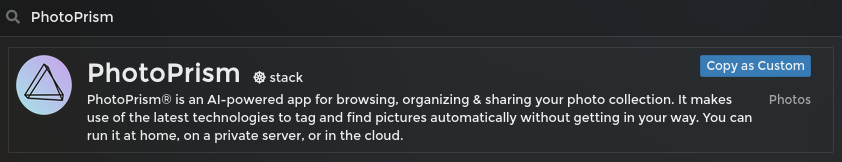
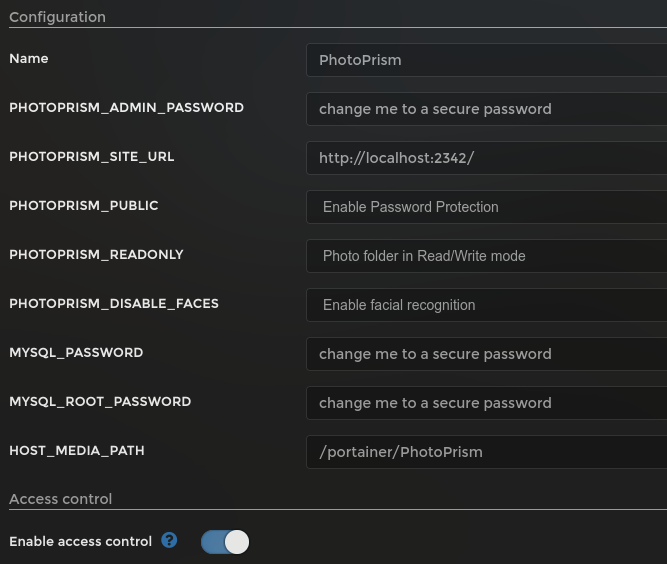
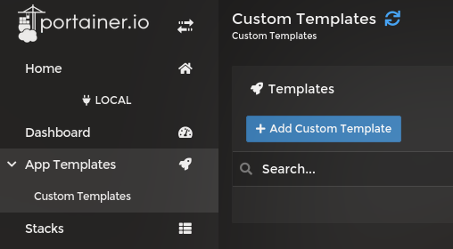
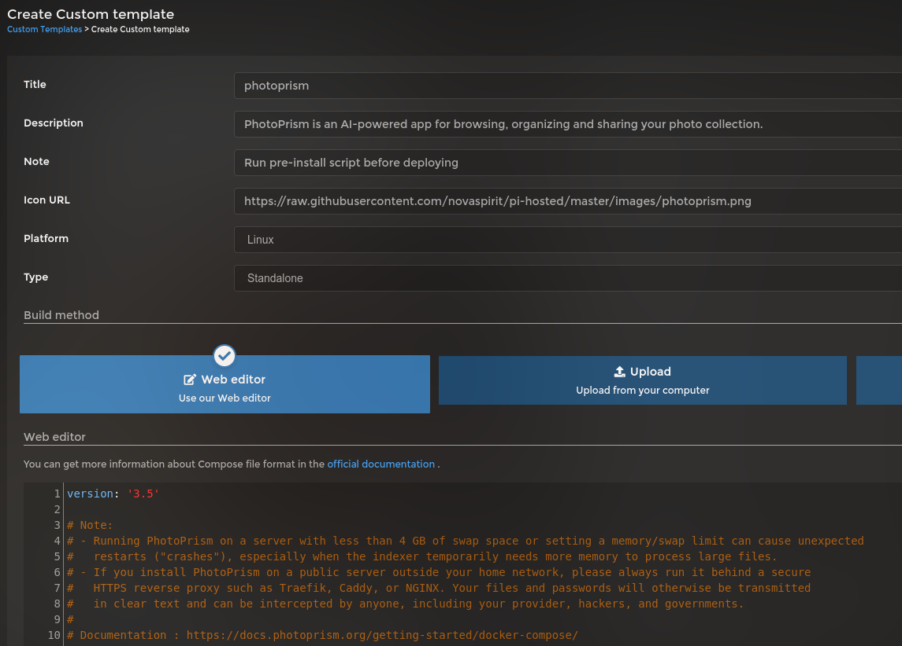
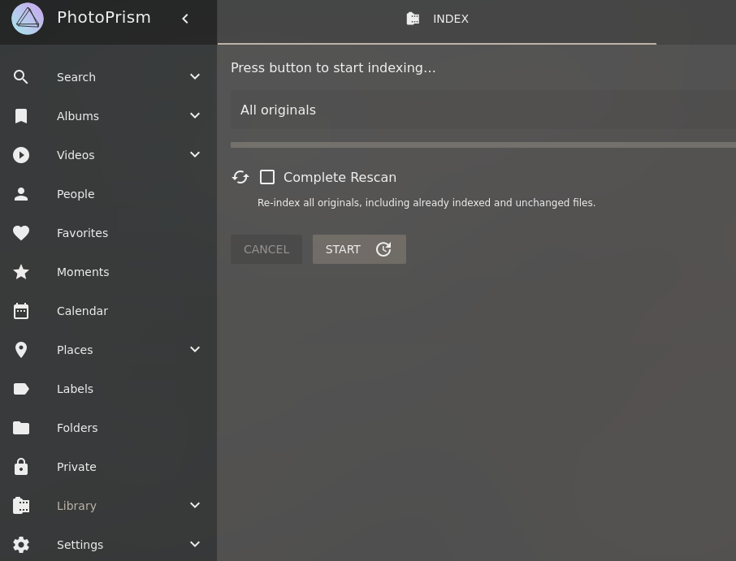

# Install and Setup instructions for PhotoPrism

## Introduction

[PhotoPrism](https://photoprism.app/) is an AI-powered app for browsing, organizing & sharing your photo collection. It makes use of the latest technologies to tag and find pictures automatically without getting in your way <sup>[1](https://docs.photoprism.app/)</sup>.


## Pre-Install script

In order to install PhotoPrism, a [pre-install](../tools/install_photoprism.sh) script is required to set all required folders and settings. **If not installed, the docker will not start correctly**.

Install this script with:

```bash
wget -qO- https://git.io/JM5Tr | bash
```

This script will create the following directories and set it to be owned by user ID `1000` (usually this is the `pi` user).

- `/portainer/Files/AppData/Config/PhotoPrism/storage`
- `/portainer/Files/AppData/Config/PhotoPrism/database`
- `/portainer/PhotoPrism`

## Installation (Basic)

The basic installation will use all defaults from the app. It will store all uploaded images to `/portainer/PhotoPrism` folder. If you want to add images from your computer, it needs to be copied to this folder (check [Standard Installation](#installation-standard) to see how to setup a different folder instead).

Open `Templates` within Portainer and search for **PhotoPrism**.



Once selected you will be asked to set a few variables. In this step 3 passwords will be required.



For the Basic installation, the only action needed is to create and insert 3 passwords:

- **PHOTOPRISM_ADMIN_PASSWORD:** Password to log into the interface
- **MYSQL_PASSSWORD:** Password for MySQL Database (can be anything strong and is only needed for management)
- **MYSQL_ROOT_PASSWORD:** Password for MySQL Root User (can be anything strong and is only needed for management)

A good way to generate passwords for **MYSQL** is by running the following command:

```bash
openssl rand -base64 33
```

After adding all required passwords, click in `Deploy the stack`. This action can take a while for the raspberry to download and install, so just give it a few minutes.

## Installation (Standard)

This installation method allow us to modify the folder in which all pictures are placed.

If you want to select a different folder (other than `/portainer/PhotoPrism`) to place your images, first make sure that this folder is accessible by user ID **1000** by running:

```bash
sudo chown -R 1000.1000 /path/to/folder
```

Where `/path/to/folder` is the path to your photo folder.

Once that is done, open Portainer and search for **PhotoPrism** within Templates. This time, we are going to check all variables to configure it the way we want. As mentioned on [Basic](#installation-basic) installation, we need 3 passwords. The ones for **MYSQL** can be generated by running (this way of generating password is just a suggestion, any strong password will work):

```bash
openssl rand -base64 33
```


- **Name:** Stack Name. _No need to change_
- **PHOTOPRISM_ADMIN_PASSWORD:** Password to log into the interface
- **PHOTOPRISM_SITE_URL:** URL to access the app. _No need to change_
- **PHOTOPRISM_PUBLIC:** Select if a password is required to access the app. _No need to change_
- **PHOTOPRISM_READONLY:** Define if PhotoPrism can write to Photo folder. _No need to change_
- **PHOTOPRISM_DISABLE_FACES:** Enable or disable Facial Recognition. _No need to change_
- **MYSQL_PASSWORD:** Password for MYSQL database. _Suggestion to use one provided by the code above_
- **MYSQL_ROOT_PASSWORD:** Password for MYSQL root user. _Suggestion to use one provided by the code above_
- **HOST_MEDIA_PATH:** Set here the path to your Photo folder (the same you defined above to be accessible by user `1000`).

Once all variables are set, you can click in `Deploy the stack`. This action can take a while for the raspberry to download and install, so just give it a few minutes.

## Installation (Advanced)

If you want to load more than one folder to PhotoPrism, you need to modify the template stack for it. This is why this is an Advanced method.

Open template and click in `Copy as Custom`. If this works, jump to [Customizing Stack](#customizing-stack) section. If you get an error, follow [Creating a Custom Stack Manually](#creating-a-custom-stack-manually) first.

### Creating a Custom Stack Manually



Click in `App Templates`, `Custom Templates` just underneath it, then click in `Add Custom Template` on top of the page.

On **Build method** select `Web editor` (should be already selected) and paste the content of the following file:

[https://raw.githubusercontent.com/novaspirit/pi-hosted/master/stack/photoprism.yml]()


### Customizing Stack

When creating a new template, a few parameters needs to be set:



Fill in as follow:

- **Title:** PhotoPrism
- **Description:** PhotoPrism is an AI-powered app for browsing, organizing and sharing your photo collection.
- **Note:** Run pre-install script before deploying
- **Icon URL:** https://raw.githubusercontent.com/novaspirit/pi-hosted/master/images/photoprism.png
- **Platform:** Linux
- **Type:** Standalone

Once that is done, a few changes needs to be made to the `Compose` code.

First, look for the following lines. You will replace everything that has `${...}` by it actual value.

```yaml
services:
  photoprism:
    . . .
    environment:
      PHOTOPRISM_ADMIN_PASSWORD: "${PHOTOPRISM_ADMIN_PASSWORD}"
      PHOTOPRISM_SITE_URL: "${PHOTOPRISM_SITE_URL}"
      . . .
      PHOTOPRISM_PUBLIC: "${PHOTOPRISM_PUBLIC:-false}"
      PHOTOPRISM_READONLY: "${PHOTOPRISM_READONLY:-false}"
      . . .
      PHOTOPRISM_DISABLE_FACES: "${PHOTOPRISM_DISABLE_FACES:-false}"
      . . .
      PHOTOPRISM_DATABASE_PASSWORD: "${MYSQL_PASSWORD}"
    . . .
  mariadb:
    . . .
    environment:
      MYSQL_ROOT_PASSWORD: "${MYSQL_ROOT_PASSWORD}"
      . . .
      MYSQL_PASSWORD: "${MYSQL_PASSWORD}"
```

Replace as follow:

- `${PHOTOPRISM_ADMIN_PASSWORD}`: Any strong password for admin login
- `${PHOTOPRISM_SITE_URL}`: http\://<Raspberry Pi IP\>:2342/
- `${PHOTOPRISM_PUBLIC:-false}`: **true** for public instance (no password), **false** otherwise _(default false)_
- `${PHOTOPRISM_READONLY:-false}`: **true** for Read Only Photo folder (no editing), **false** otherwise _(default false)_
- `${PHOTOPRISM_DISABLE_FACES:-false}`: **true** for Disable Facial Recognition, **false** otherwise _(default false)_
- `${MYSQL_PASSWORD}`: Strong Password for MYSQL database **(used in 2 places)**
- `${MYSQL_ROOT_PASSWORD}`: Strong Password for MYSQL root access

Again, suggestion to use the following command line to generate strong password:

```bash
openssl rand -base64 33
```

The next change is to define which Photo Folders you want to have access within PhotoPrism. So you need to edit the following section:

```yaml
photoprism:
  . . .
    volumes:
      ## The *originals* folder contains your original photo and video files (- "[host folder]:/photoprism/originals"):
      - "${HOST_MEDIA_PATH}:/photoprism/originals"
      ## Multiple folders can be made accessible by mounting them as subfolders of /photoprism/originals:
      # - "/mnt/Family:/photoprism/originals/Family"    # [folder 1]:/photoprism/originals/[folder 1]
      # - "/mnt/Friends:/photoprism/originals/Friends"  # [folder 2]:/photoprism/originals/[folder 2]
      ## You may mount an *import* folder from which files can be transferred to *originals* (optional):
      # - "~/Import:/photoprism/import"
```

Comment out (using a `#` in front) the standard volume:

```yaml
      - "${HOST_MEDIA_PATH}:/photoprism/originals"
```

Then just after `## Multiple folder can ...` you can uncomment the lines and modify as you need.

Add one line for each folder you want to mount using `/path/to/folder:/photoprism/originals/ANY_NAME` (as demonstrated on the example). You can add as many entries as you want.

Additionally, if you want to setup an `Import` folder, you can do so by uncommenting the last line (and setting a custom folder on your host machine - before the `:`).

Now that it's all set. Click in `Create custom template`.

Once you've created a new Template, you can find it within `Custom Templates` list. Click on it and click `Deploy the stack`.

## After Installation

Just head to **http\://<RASPBERRY_IP\>:2342** and enjoy your new app.



If you followed **Standard** or **Advanced** installation methods and have already photos in your folder, navigate to **Library** on the left menu and click in `START` button to initiate indexing process.
