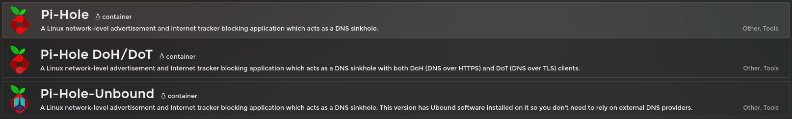
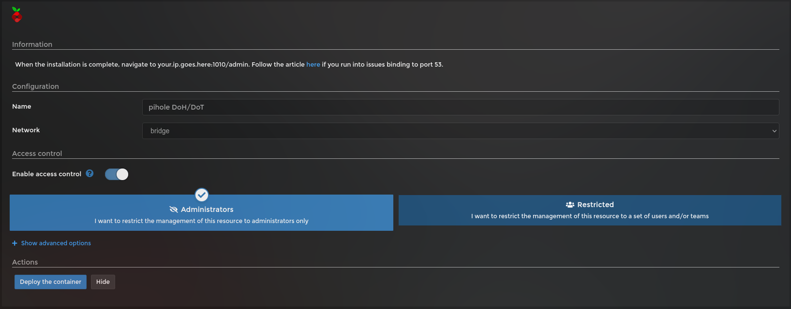
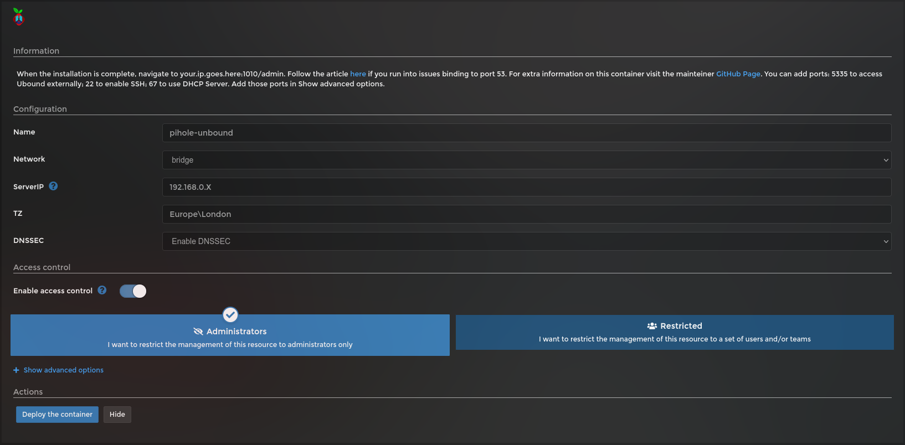
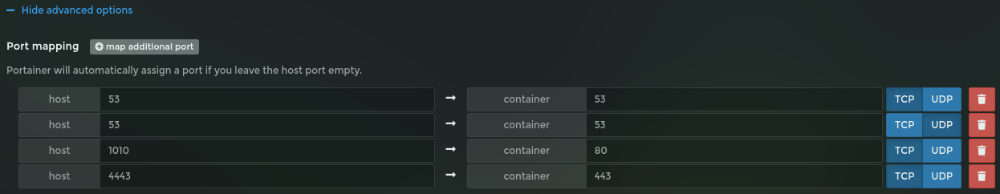
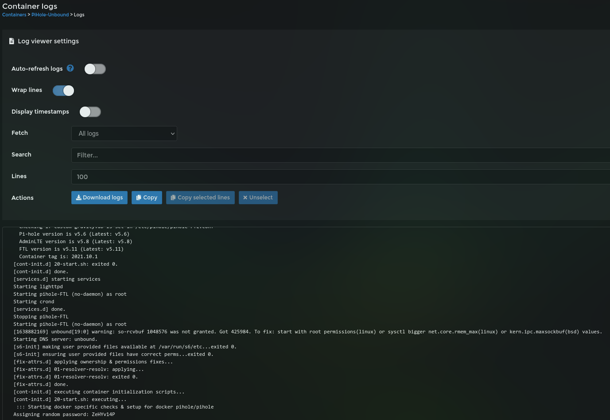
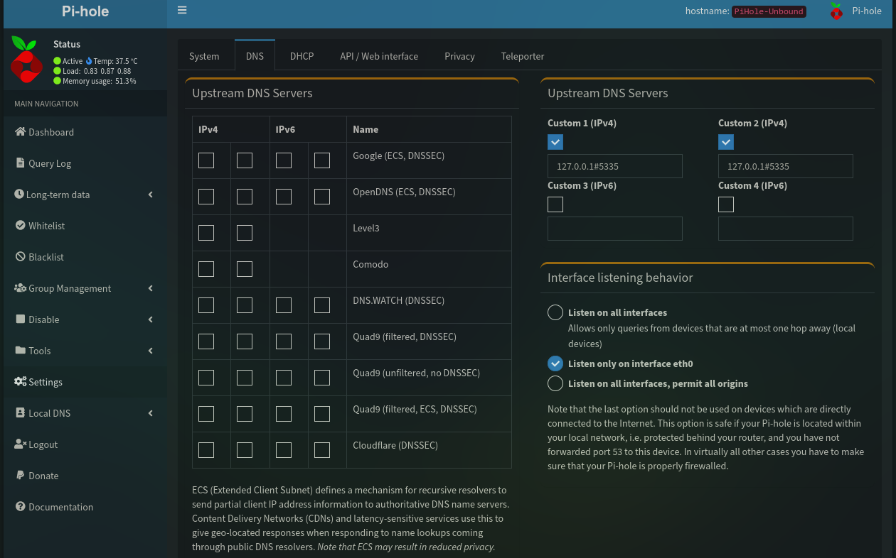
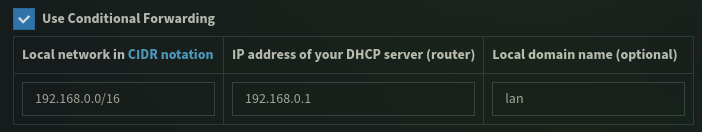

# Install and setup instructions for Pi-Hole DNS Ad Blocker

## Introduction

[Pi-Hole](https://pi-hole.net/) is a network-wide **Ad Blocking** based on [DNS](https://en.wikipedia.org/wiki/Domain_Name_System) filter. It can also act as a [DHCP](https://en.wikipedia.org/wiki/Dynamic_Host_Configuration_Protocol) server _(not covered in this Doc)_ in case you need.

There is 3 template options available:

- **[Pi-Hole](#pi-hole-installation)**: It's a docker with Pi-Hole only
- **[Pi-Hole DoH/DoT](#pi-hole-dohdot-installation)**: Docker built with both [DoH](https://en.wikipedia.org/wiki/DNS_over_HTTPS) (DNS over HTTPS) and [DoT](https://en.wikipedia.org/wiki/DNS_over_TLS) (DNS over TLS). _[Documentation In-Progress]_
- **[Pi-Hole-Unbound](#pi-hole-unbound-installation)**: Docker built with [Unbound](https://nlnetlabs.nl/projects/unbound/about/) software integrated for self-hosted DNS server.

## Pi-Hole Installation

Pi-Hole only default configuration from App Template are good and no action is required. Just click in deploy.

It will map ports:

- **53** -> For DNS queries (TCP/UDP)
- **67** -> For DHCP server (UDP)
- **1010** -> For Web interface HTTP (accessed with `http://<Raspberry IP>:1010/admin`)
- **4443** -> For Web interface HTTPS (accessed with `https://<Raspberry IP>:4443/admin`)

It will map:

- **Configuration folder**: `/portainer/Files/AppData/Config/PiHole`
- **DNS Settings**: `/portainer/Files/AppData/Config/PiHole/DNS`

Once deployed go to [Post Installation](#post-installation) section.

## Pi-Hole DoH/DoT Installation

It follows all the same configuration and ports as the [standard installation](#pi-hole-installation) and no further configuration is required. It uses a different mapped folder:

- **Configuration folder**: `/portainer/Files/AppData/Config/PiHole_DoH-DoT`
- **DNS Settings**: `/portainer/Files/AppData/Config/PiHole_DoH-DoT/DNS`

Once deployed go to [Post Installation](#post-installation) section.

## Pi-Hole-Unbound Installation

To install Pi-Hole with Unbound option, the following settings needs to be set:

- **ServerIP** -> This is the IP of your Raspberry Pi, so docker can configure the DNS server properly
- **TZ** -> Time zone setting so all logs are written in the correct time
- **DNSSEC** -> Option to enable or disable [DNSSEC](https://en.wikipedia.org/wiki/Domain_Name_System_Security_Extensions), default configuration is Enabled.

By default only ports **53** (DNS), **1010** (HTTP Web Interface), **4443** (HTTPS Web Interface) are opened.

You can open the following ports for extra functionalities:

- **22/TCP** -> Enable SSH connection to the docker _(not recommended)_
- **67/UDP** -> Open port for DHCP Server

To open extra ports, click in `Show advanced options` just above `Deploy the container` button and then click in `map additional port`. Enter Host Port first then Container Port after and select the protocol. The ports described above are for Container Port, you can use the same number or a different one on the host (although it's best to keep port 67 for DHCP).

Once all variables are set and extra ports (if required) opened, deployed the container and go to [Post Installation](#post-installation) section.

## Post Installation

### Admin Password

Once deployed, open the container logs, disable `Auto-refresh logs` so you can scroll freely and look for `Assigning random password: XXXXXXXX` to get the Admin password.

You can set a new password opening the Console through Portainer and typing `pihole -a -p` and enter the password when requested.

You can find more commands to run [here](https://docs.pi-hole.net/core/pihole-command/).

With the admin password, go to `http://<Raspberry IP>:1010/admin` to access Pi-Hole web interface and log in.

### Setting Mainstream DNS

Go to `Settings` and select `DNS` on top.

On the left hand side you can select anyone of the know DNS providers or insert a custom one on the right hand side (_**Note: if you are using Unbound, the custom DNS is already configured properly**_).

You can also set `Use Conditionnal Forwarding` in order for the Pi-Hole to ask your DHCP server the host name of the local IPs. For this to work, define your local network [CIDR](https://en.wikipedia.org/wiki/Classless_Inter-Domain_Routing) (I've used 192.168.0.0/16 that covers all possible subnets within 192.168.x.x range), then insert the IP of your DHCP server (normally your router) and optionally a local domain name.

If you're having loop issues with your router, then you might want to disable this option.

### Point your router or device to Pi-Hole

As each router is different to configure, I'm not going to detail here how it's done. However, you can point your router DNS to Pi-Hole IP (Raspberry IP) and it will use it as the main DNS, blocking any request included on it's blacklist.

Optionally, you can set each device to use a custom DNS and insert the IP of your Raspberry.

You can also refer to [pi-hole router setup documentation](https://docs.pi-hole.net/routers/fritzbox/) for more information.

### Adding more Ad lists

You can add more lists through `Group Management` -> `Adlists`. Then just add the list you want to use.

You can visit [The Big Blocklist Collection](https://firebog.net/) if you want to add more.

## Configure Pi-Hole to get IP from the router

Configuring Pi-Hole to have an IP given by the router is not required, but it can help depending on the configuration you use on your router. If you want to force any device to use Pi-Hole as a DNS server even if they directly define a different one, having an IP different from the Raspberry helps on the configuration.

[See macvlan setup.](macvlan_setup.md)
