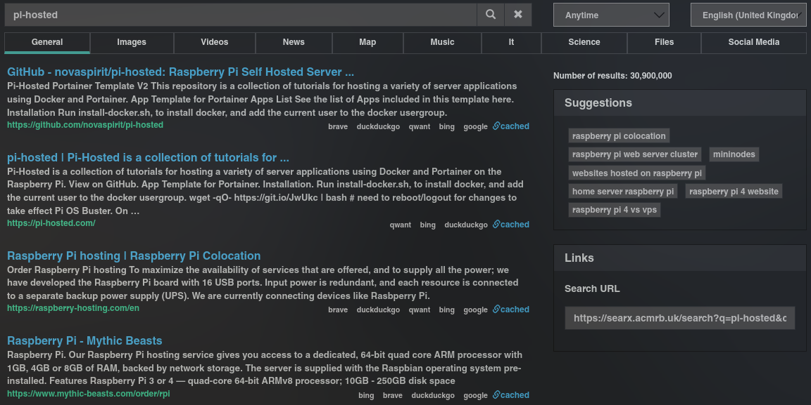
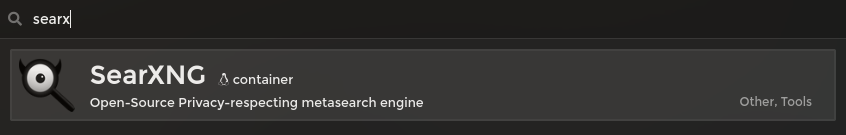
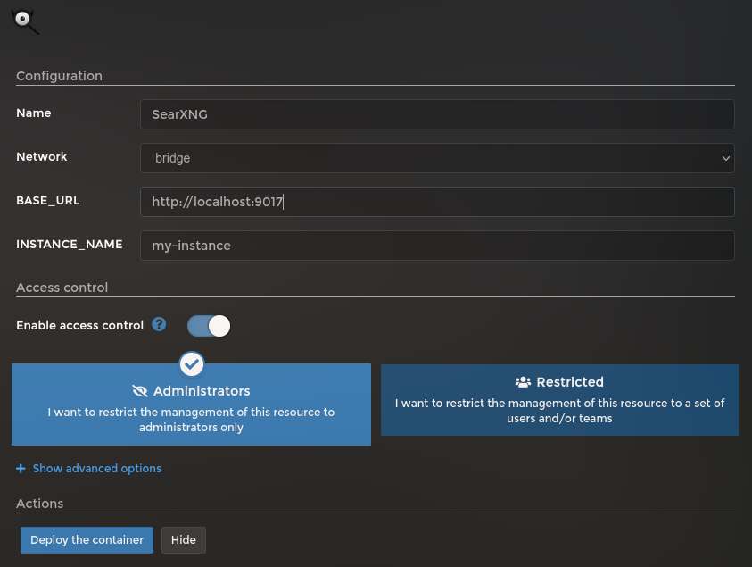

# Install and Setup instructions for SearxNG

## Introduction

[SearXNG](https://docs.searxng.org/) is a free internet metasearch engine which aggregates results from more than 70 search services. Users are neither tracked nor profiled.



## Installation



Look for `SearXNG` on Template list.



For the configuration, correct `BASE_URL` variable with a domain (if using one) or replace `localhost` with the Raspberry Pi's IP.

You can change `INSTANCE_NAME` to anything you want and it's not required.

Once done, click in `Deploy the container`.

## Configuring

Once deployed, you can view and modify all configurations under `/portainer/Files/AppData/Config/searxng/settings.yml`. Visit the [official doc page](https://docs.searxng.org/admin/engines/settings.html) for details on each setting.

The main thing you might want to do is to set:

- `general`
	+ `instance_name`: To give a more personal looking
- `search`
	+ `languages`: set here any Language you want to use
- server:
	+ `port`: DON'T CHANGE, this is set within the container
	+ `bind_address`: DON'T CHANGE, this is set within the container
	+ `base_url`: DON'T CHANGE, this is set within the container
	+ `secret_key`: A random one is generated when deploying, don't need to change
- `ui`
	+ `default_theme`: **oscar** or **simple**
	+ `theme_args`:
		* `oscar_style`: **logicodev**, **logicodev-dark** or **pointhi**

From there, you can scroll down to `engines` and **enable/disable** anyone you want.

## Troubleshooting

### Google "Suspended: too many requests"

Try enabling `use_mobile_ui: true` in google section of `/portainer/Files/AppData/Config/searxng/settings.yml` ([Reference](https://github.com/searxng/searxng/issues/531))

```yaml
 - name: google 
   engine: google 
   shortcut: go 
   # see https://searxng.github.io/searxng/src/searx.engines.google.html#module-searx.engines.google 
   use_mobile_ui: true 
   # additional_tests: 
   #   android: *test_android
```
