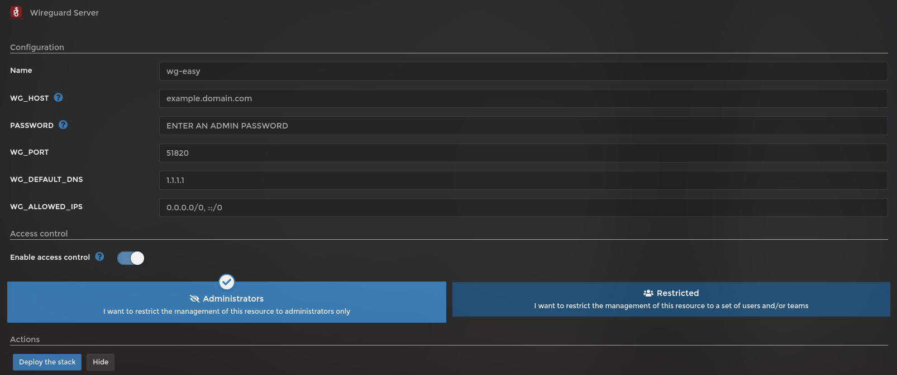

# Install and setup instructions for the WireGuard VPN Server

## Introduction

An easy to use VPN server powered by [WireGuard](https://github.com/WeeJeWel/wg-easy/).

## Screenshot

# Installation

## Pre-Installation Steps

First find Wiregaurd in the listing of templates from the project.

## Set all variables

- `WG_HOST`: A domain name (usually a DDNS) that points to your public IP
- `PASSWORD`: Password to access the WebUI interface. If left blank, there will be no login page
- `WG_PORT`: PORT to use to connect to Wireguard from outside
- `WG_DEFAULT_DNS`: DNS to use while on VPN. It can point to your router (usually 192.168.x.x) or an external one (like 1.1.1.1 or 8.8.8.8). You can set 2 separating them by comma
- `WG_ALLOWED_IPS`: IPs which connection will be allowed.

On my network I deploy a Pi-Hole for DNS level ad blocking and I also have multiple networks which all have various devices on them. So for my setup I used the following values, but make sure you use what will work for your setup:

`- WG_DEFAULT_DNS=192.168.1.1` #This is the address of my router for DNS forwarding on my network, you can use outside DNS servers for this ie. 8.8.8.8, 8.8.4.4 
`- WG_ALLOWED_IPS=0.0.0.0/0, ::/0` #This will allow all addresses from any network, you may want to lock this down for your own setup.

Once done, just click `Deploy the stack`.

### Setup a User
 
On your main browser navigate to your pi's ip address with port attached (http://192.168.1.10:51821/)

You should be greeted with a login dialog on a white screen, just enter the password you defined when editing the stack and click login.

Now we need to create a user so that you can begin using the tunnel, click the "New Client" button.

Give the user a name and click "create", now you should see the user show up on the panel.  There are a few options to use this account one being by QR code.

If you download the app to your Android/iPhone open the app and click the + button to add a tunnel.  It will ask you if you want to scan a QR code, use that.

On the panel click the generate QR code button and scan this with your phone to add the tunnel.

The profile should now show up within the app, however it will not quite work yet.

  
## Port forwarding

Every port forwarding in a ruoter is done differently so I can't tell you how to do that.  However attached is a screenshot of what my port forward rule looks like in my
routers forwarding panel to give you an idea of how it works.

  
## Connection Test

Finally with forwarding working and the WireGaurd container running you should be ready for a test.  Ensure you are not connected to your wifi network and that you have
an active cell data connection on your phone.

Click the slider next to the tunnel we setup previously and it should activate (for android phones a little key icon shows up on your notification bar).

Open your browser and go to a standard website to ensure DNS is functional. 
https://github.com/pi-hosted/pi-hosted

Next open a new tab or in the same tab navigate to an IP based service that you have NOT made available outside your network, for me that would be Homer. 
http://192.168.1.10:8902/

If you saw both pages then that means your VPN is functioning properly.  Feel free to watch your streaming services or administer your network from anywhere in the world!
